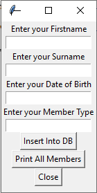

# pypyodbc Example - Save and Retrieve data from an MSAccess Database

This example allows you to both insert data into a Microsoft Access Database and retrieve Data from a Microsoft Access Database

The example requires you to install pypyodbc which is a pure python implementation of a wrapper to the native OS odbc drivers.

To to be able to use this example you must have Microsoft Access installed. The example uses the Microsoft Access Driver (*.mdb, *.accdb) 

This driver is installed on Windows when you install Microsoft Access.

In order to install pypyodc type the following line from within your Command Line Interface

pip install pypyodbc

Once this package is installed you can try the programs insertTCMemberTest.py and printAllMembers.py

The programs should insert a new member of the tennis club into the table called member and print all the members of the club to the screen.

# Part 1

Adapt a previous TKInter GUI Interface you have built to allow it to capture details about a new member of the Tennisclub database as follows

# Part 2

Take code from the insertTCMemberTest.py and add it to the GUI Class you have built in part 1 so that when the button is clicked the details of the new Tennis Club member which the user entered are inserted into the Member table of the TennisClub Database

# Part 3

Add another button so that when that button is clicked all the members of the tennis club that are stored in the Member table of the tennisclub database are printed to the Screen

